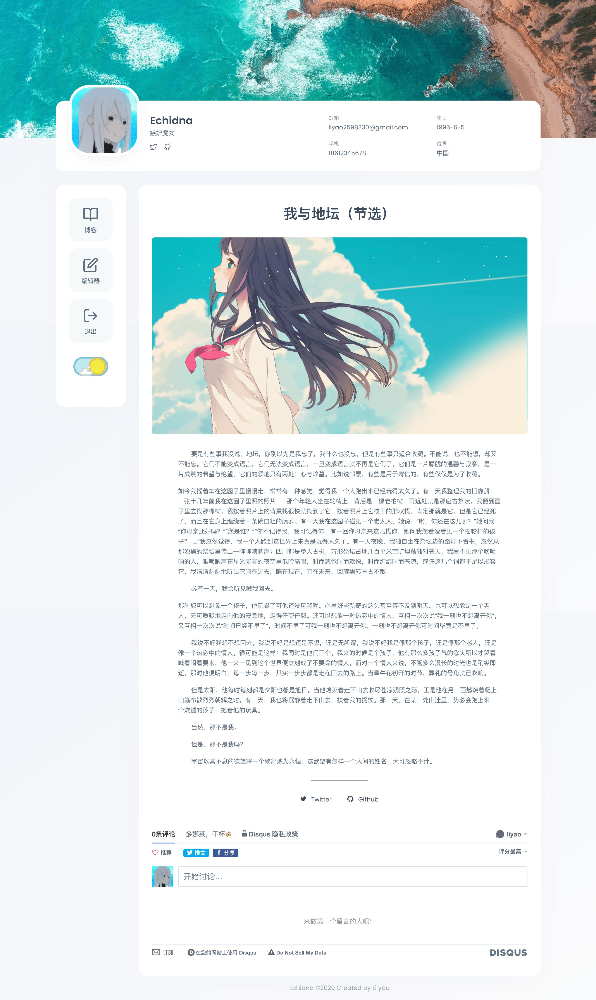

# Echidna - 基于django的博客

[](https://github.com/RichardLitt/standard-readme)

Echidna是一个基于`Python3.7`和`Django3`的博客系统





## 特点
* 好玩的登录方式（使用终端登录）
* 支持黑夜模式
* 流畅的动效与交互体验
* 愉悦的书写体验
    * 图片支持粘贴
    * 图片支持拖拽缩放大小
    * 支持复制粘贴Word，excel
    * 代码高亮（两种高亮风格黑夜模式与白天模式自动切换）
    * 自动保存草稿
    * 文章支持设置标签，分组，支持设置密码
* 引入disqus评论
    
## 开发中
新的页面：
* 我的项目
* 关于我

新的功能：
* 文章检索功能
* 文章目录

## 目录

- [特点](#特点)
- [开发中](#开发中)
- [安装](#安装)
- [使用](#使用)
- [作者](#作者)
- [贡献](#贡献)
- [许可证](#许可证)

## 安装

```shell script

```

## 作者

[@liyao2598330](https://github.com/liyao2598330)

## 贡献

你可以新开一个[issue](https://github.com/liyao2598330/echidna/issues/new) 或提交PR来参与


## 许可证

[MIT](LICENSE) © liyao2598330
